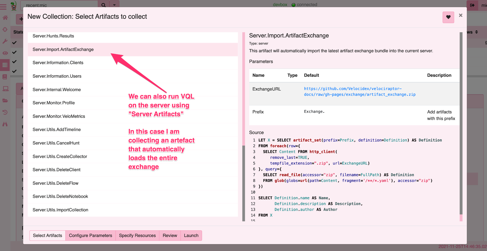
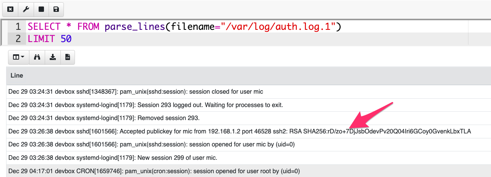
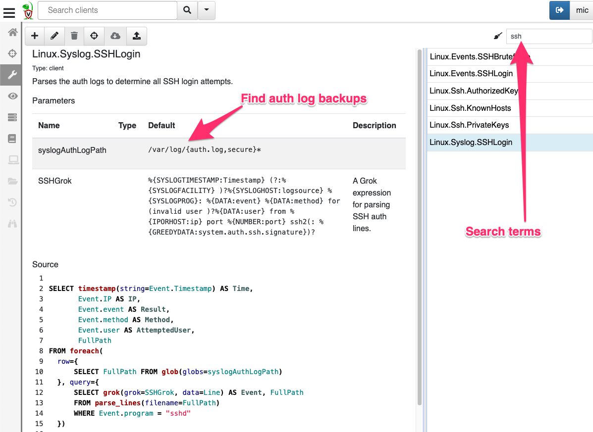
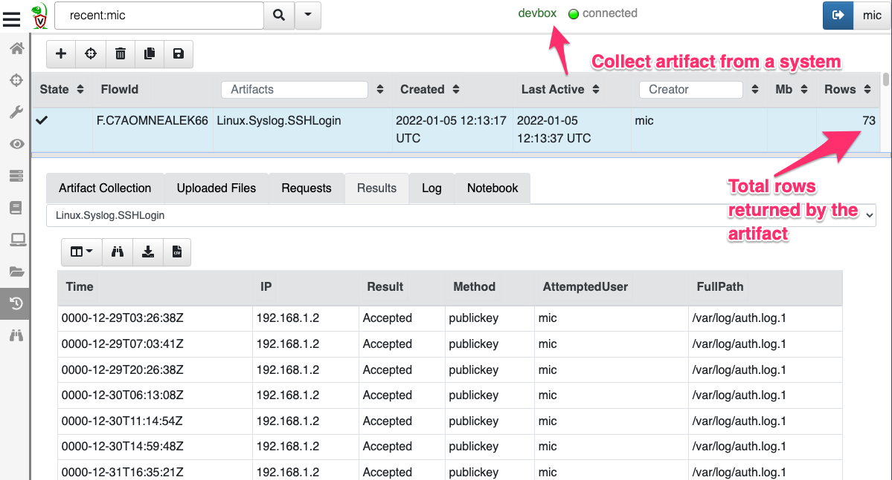
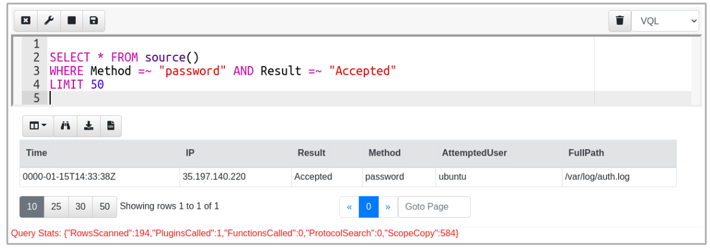
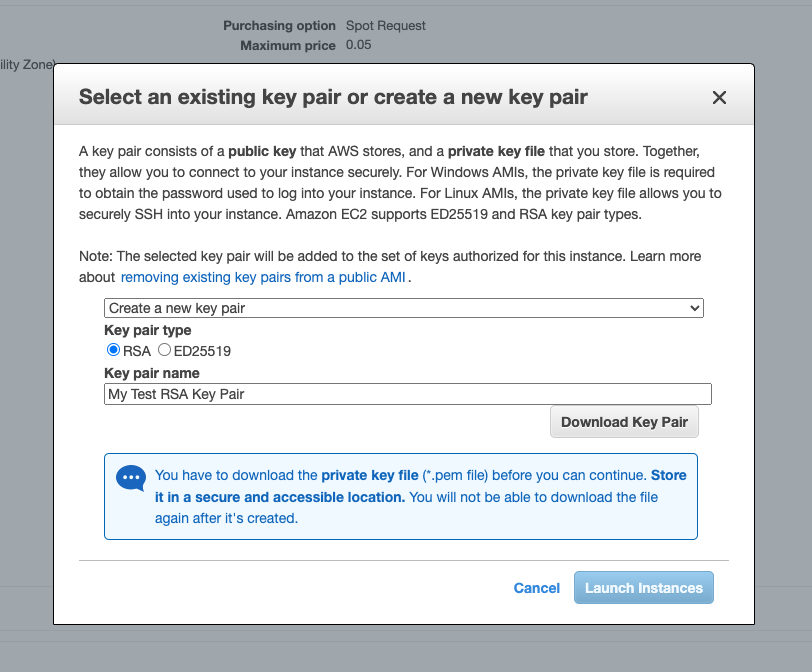
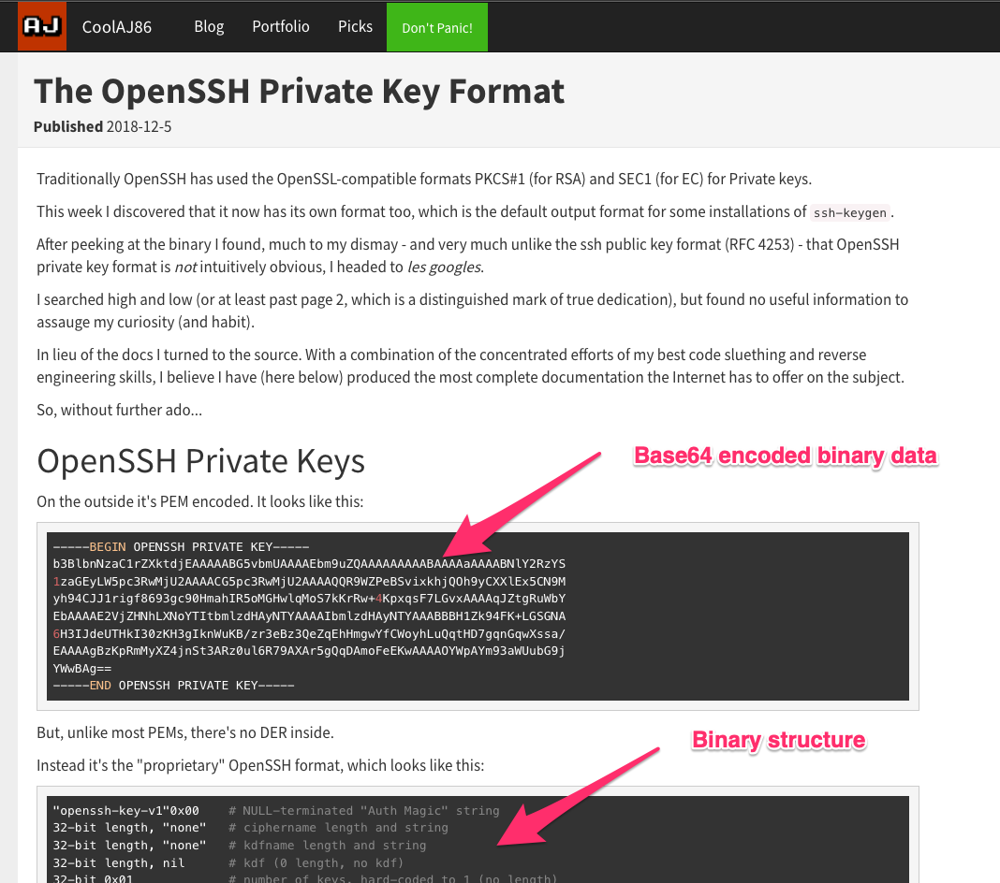
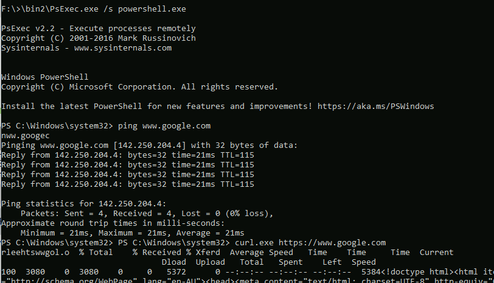
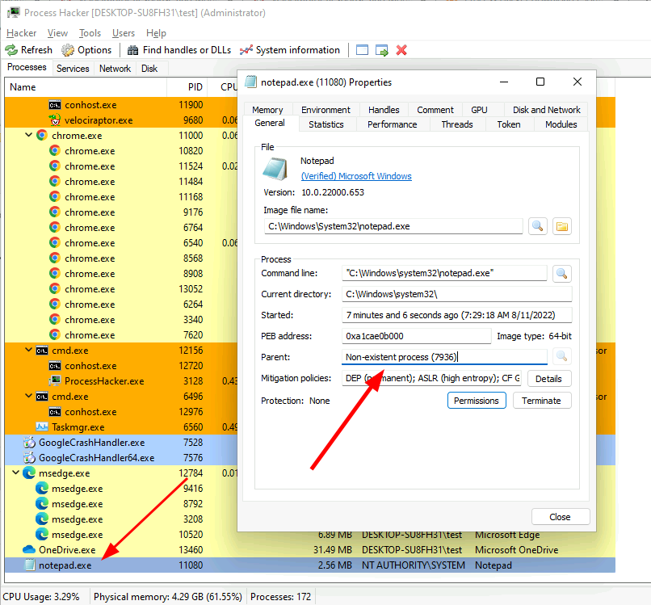
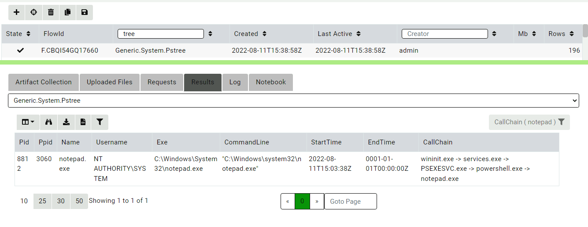

<!-- .slide: data-background="assets/title.svg" class="title" -->
# Digging Deeper...

<div class="inset">

## SANS DFIR Summit 2022

### Mike Cohen, Digital Paleontologist

</div>

---

<!-- .slide: data-background="assets/content_slide.svg" data-background-color="white" data-background-size="contain" class="content" -->
## Overview

* There is no way we can cover all of the capabilities Velociraptor offers in 45 minutes!

I will concentrate on
* Open Source - How you can join and benefit from the Velociraptor community!
* Linux use case - Some examples of using Velociraptor to respond to Linux incidents.

---

<!-- .slide: data-background="assets/content_slide.svg" data-background-color="white" data-background-size="contain" class="content" -->
## What is Velociraptor?

Velociraptor is a unique Free and Open Source DFIR tool, giving you power and flexibility through the Velociraptor Query Language

VQL is used to drive a powerful set of forensic capabilities:
* Using VQL we can write custom "Artifacts" to identify emerging threats quickly and safely
* Hunt for artifacts at scale over thousands of end points within minutes!


---

<!-- .slide: data-background="assets/deployment_overview.svg" class="full_screen_diagram" -->
## Deployment overview

---

<!-- .slide: data-background="assets/content_slide.svg" data-background-color="white" data-background-size="contain" class="content" -->
## Typical deployments

* Support Linux, Windows, MacOS, FreeBSD...
* Server simply collects the results of queries - clients do all the heavy lifting.
    - Client memory and CPU usage is controlled via throttling and active cancellations.

* Server is optimized for speed and scalability
    - Concurrency control ensures stability
    - Bandwidth limits ensure network stability

---

<!-- .slide: data-background="assets/content_slide.svg" data-background-color="white" data-background-size="contain" class="content" -->
## VQL - Query Language
### Velociraptor's magic source

Rather than having specific analysis modules, VQL allows generic
capabilities to be combined in novel creative ways

* NTFS/MFT/USN/Glob file system analysis
* File parsers - Grok, Sqlite etc
* Built in powerful parser framework for novel binary parsers


---

<!-- .slide: data-background="assets/content_slide.svg" data-background-color="white" data-background-size="contain" class="content" -->
## Velociraptor Query Language

Using a query language we can string together different forensic capabilities to create novel analysis

**The Power of Open source!**

The Velociraptor artifact exchange is a place for the community to publish useful VQL artifacts for reuse


---

<!-- .slide: data-background="assets/artifact_exchange.png" data-background-size="contain" class="full_screen_diagram" -->

Notes: The artifact exchange is the place to fetch new artifacts

---

<!-- .slide: data-background="assets/content_slide.svg" data-background-color="white" data-background-size="contain" class="full_screen_diagram" -->
## Automatically Import Exchange Artifacts


---

<!-- .slide: data-background="assets/content_slide.svg" data-background-color="white" data-background-size="contain" class="content" -->
## Velociraptor Query Language
Using a query language we can string together different forensic capabilities to create novel analysis

**Example - Use Grok to detect SSH login events.**

Common compromise sequence:
* Attackers compromise one machine through a vulnerability, or password guessing
* Due to unsecured ssh keys, they can laterally move to other machines in the network.

---

<!-- .slide: data-background="assets/content_slide.svg" data-background-color="white" data-background-size="contain" class="content" -->
## Parsing SSH login events

Linux systems typically use syslog for logging
* Line based unstructured logs
* Difficult to query across systems.
* events are stored in /var/log/auth.log

Looks similar to

```text
Dec 29 07:03:41 devbox sshd[1810143]: Accepted publickey
  for mic from 192.168.1.2 port 52454 ssh2:
  RSA SHA256:rD/zo+7DjJsbOdevPv20Q04Iri6GCoy0GvenkLbxTLA
```

---

<!-- .slide: data-background="assets/content_slide.svg" data-background-color="white" data-background-size="contain" class="content" -->
## Grok for parsing syslogs

Grok is a way of applying regular expressions to extract structured information from log files.
* Used by many log forwarding platforms such as Elastic for example:

```sh
%{SYSLOGTIMESTAMP:Timestamp} %{SYSLOGHOST:logsource} %{SYSLOGPROG}:
%{DATA:event} %{DATA:method} for (invalid user )?%{DATA:user}
from %{IPORHOST:ip} port %{NUMBER:port} ssh2(:
%{GREEDYDATA:system.auth.ssh.signature})?
```
---

<!-- .slide: data-background="assets/content_slide.svg" data-background-color="white" data-background-size="contain" class="content" -->
## Let's use VQL to parse ssh events
Read the first 50 lines from the auth log




---

<!-- .slide: data-background="assets/content_slide.svg" data-background-color="white" data-background-size="contain" class="content" -->
## Filter lines and apply Grok
* Grok expressions are well published
* We won't go into detail about VQL syntax


---

<!-- .slide: data-background="assets/content_slide.svg" data-background-color="white" data-background-size="contain" class="content" -->
## Artifacts: Encapsulating VQL

Once we developed our VQL query - how do we make it easily accessible?
* Wrap it in an "Artifact":
    * A YAML file with metadata around the query.
    * Can be shared with the community
    * Can be easily discovered by users - without needing to understand VQL!

---

<!-- .slide: data-background="assets/content_slide.svg" data-background-color="white" data-background-size="contain" class="content" -->
## Linux.Syslog.SSHLogin artifact

Artifacts can be used by anyone without needing to really understand the VQL:



---

<!-- .slide: data-background="assets/content_slide.svg" data-background-color="white" data-background-size="contain" class="content" -->



---

<!-- .slide: data-background="assets/content_slide.svg" data-background-color="white" data-background-size="contain" class="full_screen_diagram" -->
## Hunt and Post Process


---

<!-- .slide: data-background="assets/content_slide.svg" data-background-color="white" data-background-size="contain" class="full_screen_diagram" -->
## Post process using VQL in Notebook


---

<!-- .slide: data-background="assets/content_slide.svg" data-background-color="white" data-background-size="contain" class="content" -->

## Example 2
### Unsecured SSH keys

<div class="container">
<div class="col">

A common mechanism of privilege escalation is compromise of SSH keys without password
* Can be immediately leveraged to gain access to other hosts
* e.g. AWS by default does not have password!

</div>

<div class="col">



</div>
</div>


---

<!-- .slide: data-background="assets/content_slide.svg" data-background-color="white" data-background-size="contain" class="content" -->

## How can I tell?

<div class="container">
<div class="col">

Private key files come in various formats and types
Let's develop some VQL to parse it

</div>
<div class="col">



</div>
</div>

---

<!-- .slide: data-background="assets/content_slide.svg" data-background-color="white" data-background-size="contain" class="content" -->
## Parsing files with VQL

We can read the file using a VQL query.


---

<!-- .slide: data-background="assets/content_slide.svg" data-background-color="white" data-background-size="contain" class="content" -->
## PSExec attack

<div class="container">
<div class="col">

For this example use the classic psexec method of running as SYSTEM.
* Launch a background notepad.exe
* After the attack we will exit.

</div>

<div class="col">



</div>
</div>

---

<!-- .slide: data-background="assets/content_slide.svg" data-background-color="white" data-background-size="contain" class="content" -->
## Suspicious Notepad?

<div class="container">
<div class="col">

Looking at a suspicious `notepad.exe` with Process Hacker
* Runs as SYSTEM User
* Has no parent?
* Where did it come from?

</div>

<div class="col">



</div>
</div>

---

<!-- .slide: data-background="assets/content_slide.svg" data-background-color="white" data-background-size="contain" class="content" -->

## Velociraptor's PSTree

Velociraptor's PSTree shows the call chain from tracked data! We can
see exited processes.



---

<!-- .slide: data-background="assets/content_slide.svg" data-background-color="white" data-background-size="contain" class="content" -->

## What lead to this process?

If we could only see the commands before this process launch...

